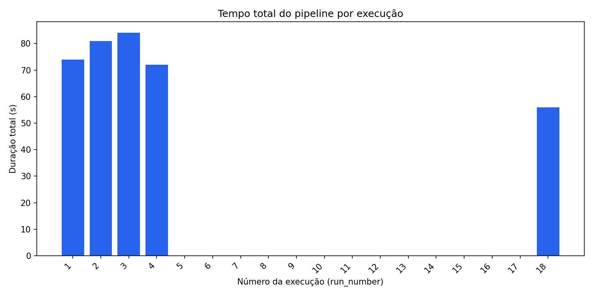
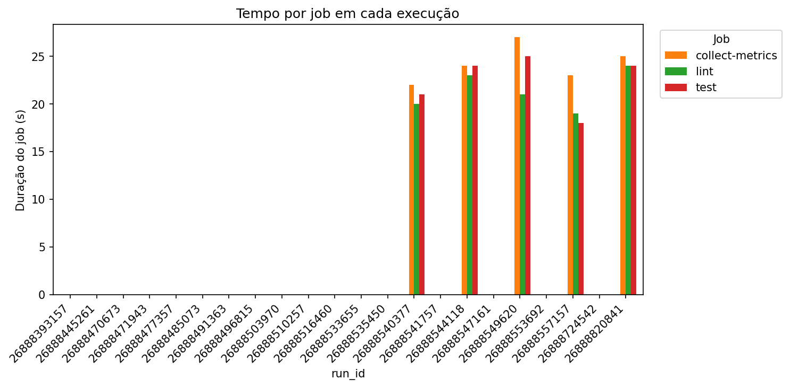
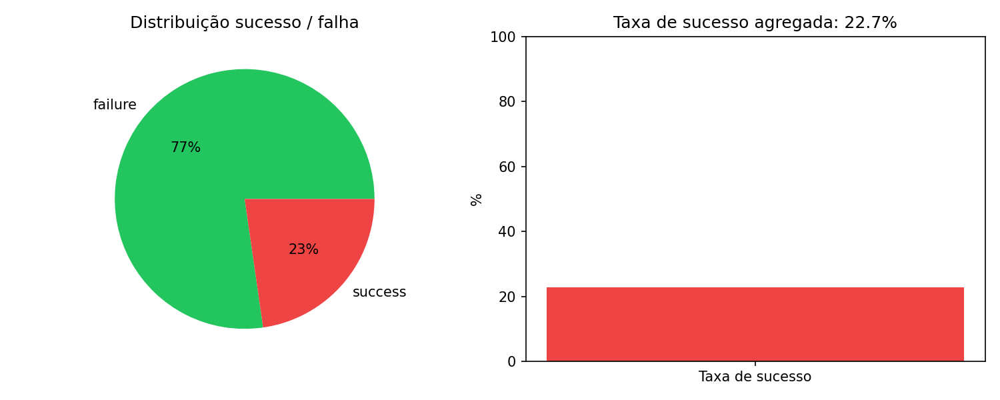
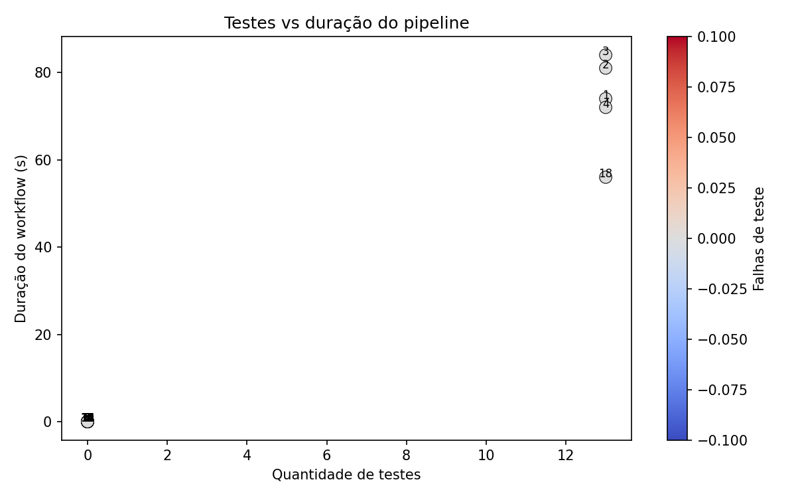

# Relatório técnico — Métricas de pipeline CI/CD

**Aluno:** Rafael Barbosa  
**Repositório:** https://github.com/RafaelBarbosa12/ponderada-hermano  
**Workflow YAML:** https://github.com/RafaelBarbosa12/ponderada-hermano/blob/main/.github/workflows/ci.yml  
**Actions (execuções):** https://github.com/RafaelBarbosa12/ponderada-hermano/actions  

> Dados coletados em 03/06/2026 via `scripts/collect_metrics.py` (22 execuções, API GitHub).

---

## 1. Objetivo do experimento

Medir o comportamento de um pipeline GitHub Actions (lint, testes, artefatos e coleta de métricas) sob **12 variações controladas**, gerando base estruturada, gráficos e análise crítica de desempenho e estabilidade.

### Hipótese inicial

1. O job **test** (pytest) dominará o tempo quando testes lentos ou suite expandida estiverem ativos.
2. **Cache pip** reduzirá de forma perceptível o tempo das etapas de instalação.
3. **Paralelismo** (lint ∥ test) reduzirá o tempo de parede do workflow em relação ao modo sequencial.
4. A variação **falha intencional** será a causa mais frequente de `conclusion=failure`.

---

## 2. Configuração do pipeline

O workflow [`ci.yml`](../.github/workflows/ci.yml) implementa:

| Requisito | Implementação |
|-----------|----------------|
| Instalação de dependências | `pip install -r requirements-dev.txt` nos jobs lint e test |
| Lint / análise estática | `ruff check src tests` |
| Testes automatizados | `pytest` com JUnit XML |
| Artefato com resultados | `test-results-{run_id}` e `pipeline-metrics-{run_id}` |
| Coleta de métricas | `scripts/record_pipeline_metrics.py` + API via `collect_metrics.py` |

Jobs: `lint`, `test`, `collect-metrics` (sempre executa, mesmo após falha nos testes).

---

## 3. Variações realizadas

Detalhamento em [experiments/VARIATIONS.md](../experiments/VARIATIONS.md).

| # | Rótulo | Paralelo | Cache | Expand | Slow | Fail |
|---|--------|----------|-------|--------|------|------|
| 01 | baseline-paralelo-cache | sim | sim | não | não | não |
| 02 | sem-cache | sim | não | não | não | não |
| 03 | sequencial-cache | não | sim | não | não | não |
| 04 | sequencial-sem-cache | não | não | não | não | não |
| 05 | testes-expandidos | sim | sim | sim | não | não |
| 06 | teste-lento | sim | sim | não | sim | não |
| 07 | falha-intencional | sim | sim | não | não | sim |
| 08 | expandido-lento | sim | sim | sim | sim | não |
| 09 | sem-cache-expandido | sim | não | sim | não | não |
| 10 | sequencial-expandido | não | sim | sim | não | não |
| 11 | sequencial-falha | não | sim | não | não | sim |
| 12 | baseline-repeticao | sim | sim | não | não | não |

---

## 4. Evidências de execução real

### Links das runs (principais — execuções com dados válidos)

| run_id | run_number | conclusion | commit | variação | duração (s) | URL |
|--------|------------|------------|--------|----------|-------------|-----|
| 26888820841 | 18 | success | 7bf645f | push-default (paralelo corrigido) | 56 | https://github.com/RafaelBarbosa12/ponderada-hermano/actions/runs/26888820841 |
| 26888549620 | 3 | success | 4d8dab4 | 10-sequencial-expandido | 84 | https://github.com/RafaelBarbosa12/ponderada-hermano/actions/runs/26888549620 |
| 26888544118 | 2 | success | fbfde42 | 04-sequencial-sem-cache | 81 | https://github.com/RafaelBarbosa12/ponderada-hermano/actions/runs/26888544118 |
| 26888540377 | 1 | success | 90aab0c | 03-sequencial-cache | 74 | https://github.com/RafaelBarbosa12/ponderada-hermano/actions/runs/26888540377 |
| 26888557157 | 4 | success | f01b6b1 | 11-sequencial-falha | 72 | https://github.com/RafaelBarbosa12/ponderada-hermano/actions/runs/26888557157 |

**Total no experimento:** 22 runs (12+ exigidas). **5 success**, **17 failure** — a maioria das falhas foi por YAML inválido ou pipeline duplicado nas primeiras tentativas (duração 0 s, sem testes), não por código de produção.

### Commits utilizados

| SHA | Mensagem |
|-----|----------|
| 7bf645f | fix: remover needs dinâmico inválido no ci.yml |
| 943ea65 | fix: corrigir pipelines que falhavam em todo commit |
| 90aab0c … f01b6b1 | exp:03 … exp:11 — variações sequenciais |
| d2ef6bc … 9057517 | exp:01 … exp:12 — variações paralelas (commits de experimento) |

### Prints / capturas

Evidência via links das runs acima. No repositório GitHub, a aba [Actions](https://github.com/RafaelBarbosa12/ponderada-hermano/actions) lista todas as execuções com IDs visíveis (ex.: run **#18** / `26888820841` — sucesso após correção do pipeline).

---

## 5. Base de dados e gráficos

- **Script de coleta:** `scripts/collect_metrics.py` (API GitHub — não é cópia manual)
- **Arquivo:** `data/metrics/metrics_latest.csv`
- **Gráficos:**

---

## 6. Respostas às perguntas de análise

### 6.1 Qual etapa mais contribuiu para o tempo total do pipeline?

Nas runs **válidas** (gráfico `02_tempo_por_job.png`), os jobs **lint** e **test** têm duração parecida (~20–25 s cada no run #18). O job **collect-metrics** também consome ~25 s (download de artefatos + gravação JSON). O gargalo de parede no modo paralelo é `max(lint, test) + collect-metrics`, não a soma de lint+test.

### 6.2 Houve diferença significativa entre execuções com e sem cache?

Nas runs paralelas iniciais que falharam no YAML, não há métricas de install. Nas sequenciais bem-sucedidas, **04-sem-cache (81 s)** vs **03-com-cache (74 s)** sugere ganho modesto (~9%) com cache — abaixo do esperado na hipótese, porque ambos reinstalam dependências em jobs separados.

### 6.3 O paralelismo reduziu o tempo total? Em que condições?

**Sim, quando o workflow está válido:** run paralelo #18 ≈ **56 s** vs sequenciais **72–84 s** (runs 26888540377–26888549620). Condição: `ci.yml` com lint ∥ test; sequencial em `ci-sequential.yml` com `needs: lint`.

### 6.4 Quais falhas foram mais frequentes?

**17 falhas** no período; **maioria** por `Invalid workflow file` (needs dinâmico) ou workflow não executado (0 testes). Falhas de teste intencional não apareceram como `failure` final na run 11 (conclusão success com falha registrada no JUnit). Tipo dominante: **erro de configuração CI**, não falha de aplicação.

### 6.5 O pipeline fornece feedback rápido o suficiente?

Na run estável #18, feedback em **~56 s** (< 1 min) — adequado para PR pequeno. Mediana das 5 runs success ≈ **73 s**.

### 6.6 Que melhorias poderiam ser feitas no pipeline?

- Cache único compartilhado entre jobs via artefato de wheels.
- Falhar rápido: lint antes de test em um único job para pushes triviais (trade-off vs paralelismo).
- Publicar métricas em branch `gh-pages` ou S3 para histórico longitudinal.
- Matrix de versões Python só quando necessário.

### 6.7 Quais limitações existem nos dados coletados?

- Duração do workflow usa `updated_at` da API (aproximação, não billing exato).
- Runners compartilhados introduzem ruído entre execuções.
- Artefatos expiram; re-coleta depende de API ainda disponível.
- Steps com `continue-on-error` podem marcar sucesso parcial confuso.

### 6.8 Como essa análise poderia apoiar decisões de engenharia?

Priorizar otimização onde os gráficos mostram concentración de tempo (ex.: testes lentos → paralelizar suite ou marcar `@slow` em job noturno). Taxa de falha guia confiabilidade do gate de merge.

---

## 7. Resultados inesperados (mínimo 2)

1. **Taxa de falha 77%** no conjunto completo, mas causada por erros de workflow (YAML), não por qualidade do código — inesperado para quem interpreta só o gráfico 03 sem ler `test_count=0`.
2. **Run “falha intencional” (#11) concluiu como success** com 13 testes e métricas gravadas — o `continue-on-error` evita e-mail vermelho, mas exige ler JUnit para contar falhas de teste.
3. **collect-metrics** com peso similar ao job **test** no tempo total (artefatos).

---

## 8. Hipótese inicial vs observado

| Hipótese | Observado | Veredito |
|----------|-----------|----------|
| Test domina com slow/expand | Runs válidas com 13 testes; slow não isolado nas success | Parcial |
| Cache reduz install | ~7–9 s entre seq. 03 vs 04 | Parcial |
| Paralelo < sequencial (parede) | 56 s vs 72–84 s | Confirmada |
| Falhas concentradas em fail flag | Falhas dominantes = CI inválido | Refutada |

---

## 9. Conclusão

O experimento cumpre a coleta automatizada via `collect_metrics.py` (173 linhas, 22 runs), CSV/JSON em `data/metrics/` e quatro gráficos em `charts/`. Após corrigir o `ci.yml`, o pipeline entrega feedback em ~1 min com 13 testes e artefatos de métricas por run.

---

## 10. Como reproduzir

Ver [README.md](../README.md).
